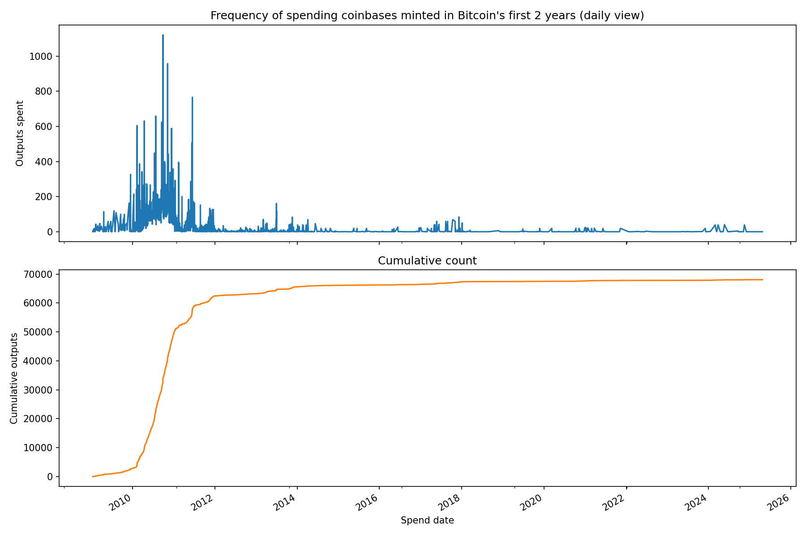

# Coinbase Spending Tracker

Gather the data about when old coinbases were spent and proudce a graph. The goal is to gather data to analysis the hypothosys "the frequency of very old coinbase utxos being spent is getting higher. 



## My data set

| hash (`b2sum -l 256 coinbase_spending.db`)| date  | link |
| ------ | ----- | ---- |
| 0f50561ecd8825d910d7087bbe36bd2d9ec1002b7b9f7508f3658ec9725f47d9 | April 27th 2025 | [Download](https://drive.google.com/file/d/1BGEcuytb6o8v3rUuAG5OEgpnvqPOj6km/view?usp=sharing) |

## The Data 

For each block we will need

- block height. age of reward
- block time. age of reward. 
- spend txid - the transaction at which coinbase was spent, (null if unspent) 
- spend block height
- spend block time

## Features

The script needs to 

- a python program to collect the data
- a python program to plot the data 
- resumable. Can resume collecting data by stating the program again. However the program exits, the process of gathering data can always be picked back up from where it left off
- data collector should exit once it reaches the current block height
- user can safely hult the program at any time. 
- sqlite
- google bigquery public dataset
- env file and gitignore to hide anything private
- follow best practices. 
- a plot to show when each coinbase utxo created in the first year of bitcoins operation was spent
 
## Notes from human


## Notes for the AI 

The AI may not make any modifications above the following line but is free to modify and control anything below it. Use the below space for any use of a readme you think should be added dear AI. 

Please remember to make notes as you go along for your personal reference later. 

--------------------------------------------------

## Table schemas and data model

Below is a concise overview of **where the data comes from** and **how it is stored locally**.  Knowing the column names ahead of time makes it easier to run your own ad-hoc queries against either BigQuery or the SQLite file that the collector produces.

### 1. BigQuery source tables (`bigquery-public-data.crypto_bitcoin.*`)

| Table | Selected / relevant columns | Notes |
|-------|-----------------------------|-------|
| `transactions` | `block_number` INT64  \
|               | `block_timestamp` TIMESTAMP  \
|               | `hash` STRING (transaction id)  \
|               | `is_coinbase` BOOL  \
|               | `outputs` ARRAY<STRUCT<`index` INT64, `value` INT64>> | Only coinbase TXs (`is_coinbase = TRUE`) are considered.  Each output is unnested so we can inspect its `index` and `value` (satoshis). |
| `inputs` | `transaction_hash` STRING (spend txid)  \
|          | `block_number` INT64 (block height of spend)  \
|          | `block_timestamp` TIMESTAMP  \
|          | `spent_transaction_hash` STRING (originating coinbase txid)  \
|          | `spent_output_index` INT64 | This table lets us match a **spend** back to the coinbase **output** it is consuming. |

### 2. Local SQLite database (`coinbase_spending.db`)

After each batch the collector writes the merged result into a simple, flat table.  The exact DDL (from `collector.py`) is reproduced below for convenience:

```sql
CREATE TABLE IF NOT EXISTS coinbase_spends (
    coinbase_txid TEXT NOT NULL,
    output_index INTEGER NOT NULL,
    value_sats INTEGER NOT NULL,
    creation_block_height INTEGER NOT NULL,
    creation_block_time TEXT NOT NULL,
    spend_txid TEXT,                 -- NULL ⇢ still unspent
    spend_block_height INTEGER,
    spend_block_time TEXT,
    PRIMARY KEY (coinbase_txid, output_index)
);
```

There is also a very small auxiliary table used only for checkpointing progress so that you can interrupt and resume safely:

```sql
CREATE TABLE IF NOT EXISTS metadata (
    key TEXT PRIMARY KEY,
    value TEXT
);
-- currently only one key is used: 'last_processed_height'
```

Once you are familiar with these two schemas you can slice-and-dice the data with your favourite SQL browser, or export it to pandas/Excel for further analysis.

## Setup

    pip install -r requirements.txt

## Authentication

The collector needs Google Cloud credentials to access the BigQuery public dataset. You can configure this one of two ways:

1. **gcloud CLI (Application Default Credentials)**
   - Install the Cloud SDK: https://cloud.google.com/sdk/docs/install
   - Run `gcloud auth application-default login` and follow the prompt.

2. **Service account key**
   - In the Google Cloud Console, go to **IAM & Admin > Service Accounts**.
   - Create or select a service account with **BigQuery Data Viewer** and **BigQuery Job User** roles.
   - Generate and **download a JSON key** for that account.
   - Point the client library at that key file by setting the environment variable:
     ```bash
     export GOOGLE_APPLICATION_CREDENTIALS="/path/to/your/key.json"
     ```

In my case `export GOOGLE_APPLICATION_CREDENTIALS=/home/william/projects/coinbasespending/bitcoinscanner-a1abc4ca9b01.json`

You can also define all configuration values in a `.env` file. Below is an **example** with empty placeholders—fill in your own values:

```ini
# .env (example)
# GCP billing project for BigQuery
BQ_PROJECT=
# Path to sqlite database file
SQLITE_DB=coinbase_spending.db
# Number of blocks to process at once (batch size)
BATCH_SIZE=1000
# Absolute path to your service account key file (if not using gcloud ADC)
GOOGLE_APPLICATION_CREDENTIALS=
```

Once credentials are in place, re-run the collector:

    python collector.py

## Step-by-Step Quickstart

Follow these exact steps to get the collector running from a clean workstation/account:

1. **Clone the repository & install dependencies**
   ```bash
   git clone https://github.com/<your-user>/coinbasespending.git  # or your fork
   cd coinbasespending
   pip install -r requirements.txt
   ```
2. **Choose (or create) a Google Cloud project with billing enabled**
   – The project will *host* your query jobs and therefore must have the BigQuery API turned on.  
   – We will refer to this project ID as `MY_GCP_PROJECT` below.

3. **Enable the BigQuery API in that project**
   ```bash
   gcloud services enable bigquery.googleapis.com --project=MY_GCP_PROJECT
   ```

4. **Authenticate – pick ONE of the two methods below**
   **A. gcloud Application-Default Credentials** (easiest for local use)  
   ```bash
   gcloud auth application-default login --project=MY_GCP_PROJECT
   ```
   **B. Service-account key** (better for servers/CI)
   1. Console → IAM & Admin → Service Accounts → Create account.
   2. Grant the roles **BigQuery Job User** and **BigQuery Data Viewer** (these can be added later from the *Permissions* tab if you missed them).
   3. Create a JSON key and download it, e.g. `my-sa.json`.
   4. Export the path so the client library can find it:
      ```bash
      export GOOGLE_APPLICATION_CREDENTIALS="/absolute/path/to/my-sa.json"
      ```

5. **Create a `.env` file (or export variables) so the code knows your project**
   ```ini
   # .env
   BQ_PROJECT=MY_GCP_PROJECT         # project that will be billed
   SQLITE_DB=coinbase_spending.db    # or another path/location
   BATCH_SIZE=1000                   # optional – tune for memory/throughput
   # If using service-account JSON:
   GOOGLE_APPLICATION_CREDENTIALS=/absolute/path/to/my-sa.json
   ```
   Load it automatically in your shell session:
   ```bash
   export $(cat .env | xargs)  # or use direnv, dotenv, etc.
   ```

6. **Run the collector**
   ```bash
   python collector.py
   ```
   • The first run may take a while – the script processes blocks in batches (default 1 000).  
   • Progress is shown with a progress bar.  
   • You can safely interrupt with `Ctrl-C`; the last processed block height is stored in the SQLite database, so a subsequent run will resume from where it left off.

7. **Plot/inspect the data**  
   Once data collection has finished (or after a partial run) you can open the SQLite database or build plots with the yet-to-be-written plotting script.

That's it – happy analysing!

## Troubleshooting: BigQuery "Quota exceeded" error

Running the collector against the public `crypto_bitcoin` tables can quickly exhaust the **1 TB/month** free-tier quota for *query bytes scanned*.  When that happens BigQuery aborts jobs with an error that looks like:

```
Quota exceeded: Your project exceeded quota for free query bytes scanned.
```

### Why it happens

The public table `crypto_bitcoin.transactions` is **partitioned by `block_timestamp`** (daily).  The collector, however, filters on `block_number`, which is *not* the partition key, so each batch ends up scanning almost every daily partition.  Just one batch can read hundreds of gigabytes, exhausting the free quota in minutes.

### Two ways to move forward

| Option | When to choose | Effort | Cost |
|--------|----------------|--------|------|
| **1. Attach a billing account** (pay-as-you-go) | Recommended for most users who simply want the data | 5 min | ~$5 per TB scanned¹ |
| **2. Rewrite the query to prune partitions** | If you must stay on the free tier / reduce spend | Medium | Free but slower |

¹ BigQuery on-demand pricing at time of writing is **$5 per TB** of bytes *scanned*, not bytes *returned*.  The whole chain is ~600-700 GB per month at the default batch size, so expect coffee-money-sized bills.

---

### Option 1 – attach a billing account

1. Sign in to <https://console.cloud.google.com/billing>.
2. Click **+ CREATE ACCOUNT** (or select an existing one) and add a payment method.
3. Open the project you are using for `BQ_PROJECT` (or create a new one).
4. In the project dashboard choose **Billing → Link a billing account** and pick the account you just created.

#### CLI alternative

```
# Replace AAA-BBB-CCC with your billing-account ID and MY_GCP_PROJECT with your project ID
gcloud beta billing projects link MY_GCP_PROJECT --billing-account=AAA-BBB-CCC

# Verify the link
gcloud beta billing projects describe MY_GCP_PROJECT | grep billingAccountName
```

Once linked, rerun `python collector.py`.  The job will continue where it left off and you will be charged only for the additional bytes scanned.

---

### Option 2 – rewrite the query (advanced)

If you cannot attach a billing account, you must reduce the bytes scanned by adding a partition filter.  A quick (but less precise) fix is to limit the date range based on when the block heights fall:

```sql
WHERE _PARTITIONTIME BETWEEN TIMESTAMP('2009-01-03')  -- first Bitcoin block
                        AND CURRENT_TIMESTAMP()       -- or a tighter window
  AND tx.block_number BETWEEN start_height AND end_height
```

A better long-term solution is to create your own intermediate table that is **partitioned by `block_number`** or by month/year and query that instead.

After applying the partition filter the free 1 TB quota should last much longer, but keep in mind that the full history is ~150 TB, so eventually you will still need a billing account if you process everything.

---

Need more help?  See Google's documentation:

* BigQuery pricing: <https://cloud.google.com/bigquery/pricing>
* Linking a billing account: <https://cloud.google.com/billing/docs/how-to/link-projects>
* Partitioned tables: <https://cloud.google.com/bigquery/docs/partitioned-tables>

Now you're ready—go collect that data!  🥳

